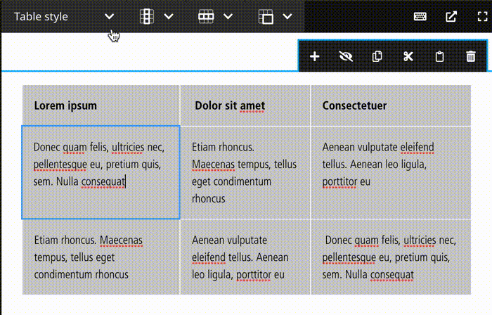

# Table styles plugin for Neos CMS    

> This package provides a drop down to add custom CSS classes to CKEditor tables in Neos CMS.

  

## Installation

To install the plugin run this in your site package folder:

    composer require --no-update pmaas/neos-tablestyles
    
Then run `composer update` in your project directory.

## Usage

Add your custom css classes to your `settings.yaml`:

    Pmaas:
      Neos:
        TableStyles:
          presets:
            label: 'Table style'
            options:
              primary:
                label: 'Primary style'
                cssClass: 'table--primary'
              secondary:
                label: 'Secondary style'
                cssClass: 'table--secondary'

Then add `tableStyles: true` to your NodeType, to activate the drop down:

    'Vendor.Package:Type.Name':
      properties:
        text:
          ui:
            inline:
              editorOptions:
                tableStyles: true

## Contributions

Contributions are always welcome!
